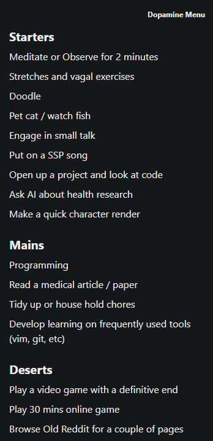

# Dopamine Menu App

This is a simple dopamine menu app designed to help the user escape doom scrolling and skinner boxes by replacing those activities with more beneficial dopamine stimulating tasks.

Long press a course title to add an item to that course.

Long press an item to remove it.

Long press the header title in the top right to reset the menu to defaults.

DEV INFO:

To test on android:

-Connect android to pc with debugging enabled.

-Open expo on phone.

-npm run android

To deploy to android:

npm install -g eas-cli

eas build:configure

eas build --platform android --profile preview

(takes about 20 minutes)
